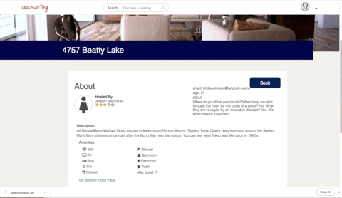

# CouchDrift
 
 [Live](https://couch-drift.herokuapp.com/#/)
 
CouchDrift is a web application that was inspired by CouchSurfing which enables users to search for and book stays at houses all over San Francisco. It was built using Java Script, Ruby on Rails, React/Redux, and PostgreSQL.

## Technologies 
* Ruby on Rails
* Javascript
* React / Redux 
* HTML / CSS
* PostgresSQL

## Features 
* Implemented user authentication for frontend and backend 
* Users can add hosting, booking, and reviews for each hostings
* Users can search hostings by location and view hosting show page by using GoogleMap API 
* Users can view details of each hostings details along with host user's details
* Users can view their bookings that they made on the home page

## Login / Sign Up Page

The splash page featrues a login button and a sign up button to get access to other features.

## Home Page

The home page features user details, hosting index, and booking index. Users can also view hostings on the Google Map by clicking the switch located on the top right corner.

## Hosting Show Page

There are three ways to view a hosting show page: click a hosting index item, click a booking index item ,or click a bed icon on the Google Map. 

On the show page, users can create a booking or leave a comment.

